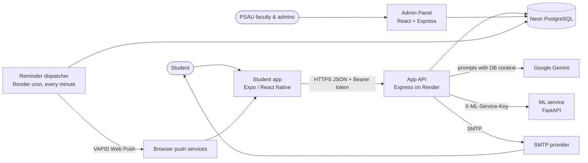
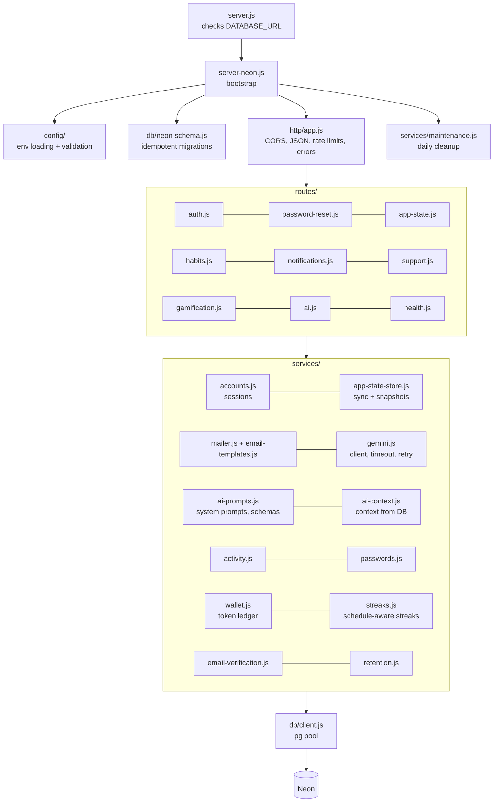
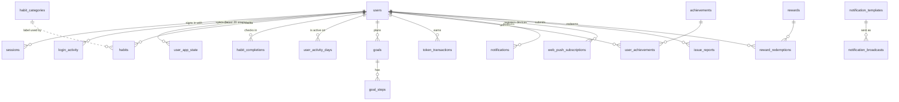
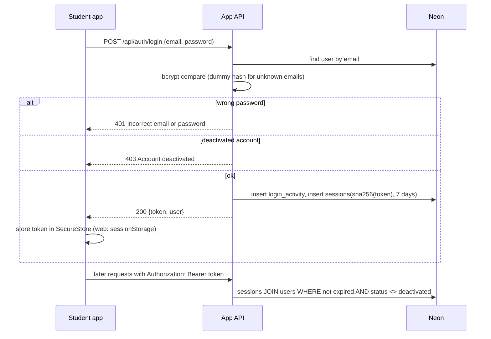
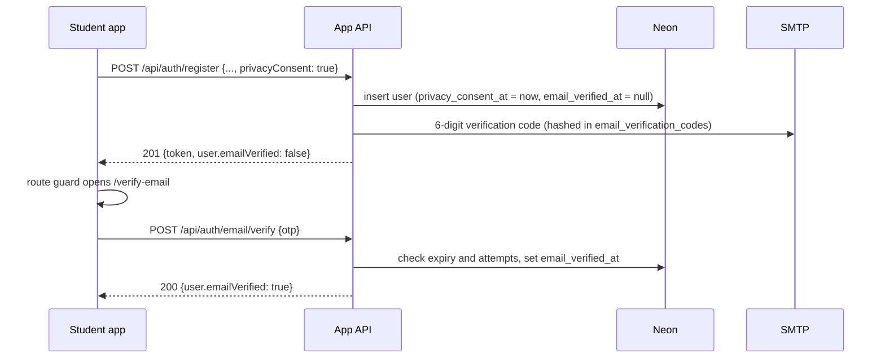
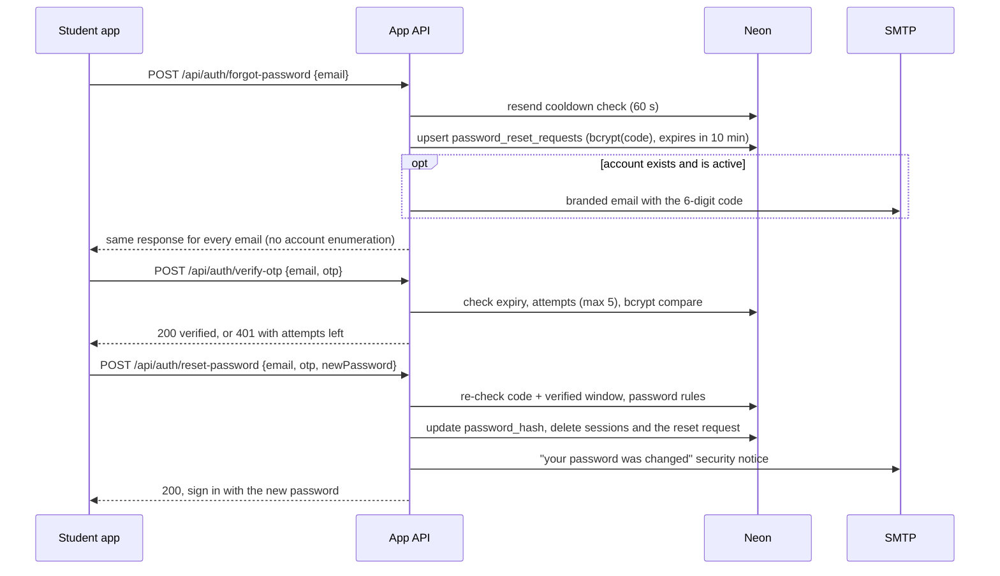
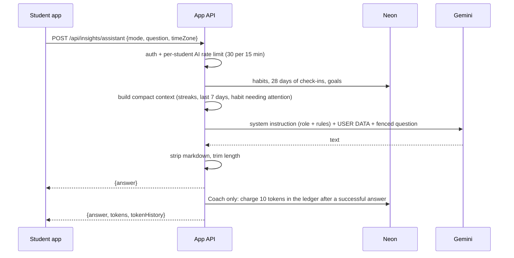
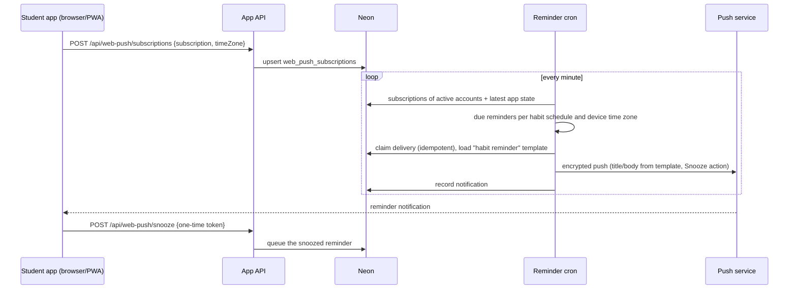

# HabitAI system architecture

HabitAI is a habit-tracking system for PSAU students. It has four deployable parts that
share one Neon PostgreSQL database:

| Part | Technology | Hosting | Purpose |
| --- | --- | --- | --- |
| Student app (`frontend/`) | Expo, React Native, Expo Router, TypeScript | Vercel / Render static site (web), Android/iOS builds | Habits, streaks, goals, AI coach, rewards, notifications |
| App API (`backend/`) | Node.js, Express 5, Zod, bcrypt, `pg` | Render web service | Accounts, sync, AI prompts, email, reminders |
| Reminder dispatcher (`backend/scripts/send-web-push-reminders.js`) | Node.js cron job, Web Push (VAPID) | Render cron, every minute | Sends due habit reminders and snoozes |
| ML service (`ml-service/`) | Python, FastAPI, scikit-learn, XGBoost | Render (Docker) | Habit completion / drop-out predictions |
| Admin Panel (`../Admin Dashboard/`) | React + Vite, Express, `pg` | Separate web service | User, category and notification management; anonymized analytics |

External services: **Neon** (PostgreSQL), **Google Gemini** (AI text), **SMTP** (a project
mailbox or transactional provider for verification codes and notices), **browser push services** (FCM, Apple, Mozilla).

## 1. System context



Design rules that the data flows below rely on:

- The **database is the single source of truth**. The app keeps a local copy for offline
  use and syncs it; the Admin Panel and AI features only read what is in the database.
- **Secrets stay on servers.** The app only holds the public API URL and its own session
  token. Gemini, SMTP, ML and database credentials exist only in server environments.
- **Everything the client sends is validated** with Zod schemas (`backend/schemas.js`),
  and every change that matters (points, leaderboard, check-ins) is recomputed on the server.

## 2. App API structure (`backend/`)



| Layer | Responsibility |
| --- | --- |
| `config/` | Loads `backend/.env` then the root `.env`; a template placeholder never hides a real value. Fails fast on bad production settings. |
| `http/` | Express assembly, CORS, JSON error handler, rate limits keyed per session token (campus Wi-Fi shares one public IP) and per IP + email for sign-in. |
| `routes/` | One module per API area. Handlers validate input, check the session, call services and shape the response. |
| `services/` | Business logic with no Express types: accounts, mail, AI, app-state storage. Unit-tested in `test/services.test.js`. |
| `db/` | Connection pool, `schema.sql`, catalog seeds and start-up migrations. |

### API overview

| Area | Endpoints |
| --- | --- |
| Accounts | `POST /api/auth/register`, `POST /api/auth/login`, `GET /api/auth/me`, `PUT /api/auth/profile`, `POST /api/auth/change-password`, `POST /api/auth/logout`, `DELETE /api/auth/account`, `GET /api/auth/login-activity`, `GET /api/auth/export` |
| Verification & consent | `POST /api/auth/email/verify`, `POST /api/auth/email/resend`, `POST /api/auth/consent` |
| Password reset | `POST /api/auth/forgot-password`, `POST /api/auth/verify-otp`, `POST /api/auth/reset-password` |
| Sync | `GET /api/app-state[?since=]`, `PUT /api/app-state`, `GET/PUT /api/habit-completions` |
| Habits | `GET /api/habit-categories`, `POST /api/habit/predict` |
| Notifications | `GET /api/notifications`, `PATCH /api/notifications/:id`, `/api/web-push/*` |
| Gamification | `POST /api/rewards/redeem`, `GET /api/leaderboard`, `POST /api/leaderboard/sync` |
| AI | `POST /api/insights/assistant` (modes `assistant`, `coach`, `support`), `POST /api/goals/generate` |
| Support | `POST /api/support/reports`, `POST /api/support/suggestions` |
| Health | `GET /healthz` (liveness), `GET /health` (dependencies) |

## 3. Data model (main tables)



- `users.role` (`user`, `faculty`, `admin`) and `users.status` (`active`, `deactivated`) are
  managed from the Admin Panel. Deactivated accounts cannot sign in and their sessions end.
- `user_app_state` holds JSON snapshots of the app state; only the newest is read and the
  API keeps the latest 20 per student. `user_activity_days` keeps one row per active day
  for engagement analytics.
- `habit_completions` is the authoritative record of check-ins: points, leaderboards,
  streaks, AI context and analytics all derive from it. A synced state can add offline
  check-ins but never delete them; only `PUT /api/habit-completions` can undo one.
- `token_transactions` is the wallet ledger. The balance is its sum: +5 per check-in (id
  unique per habit and day, so it cannot be earned twice), −5 when a check-in is undone,
  −10 per AI Coach answer, and the reward cost on redemption.
- `users.email_verified_at` and `users.privacy_consent_at` gate the app for new accounts;
  `email_verification_codes` holds hashed 6-digit codes (15 minutes, 5 attempts).

## 4. Data flows

### 4.1 Sign-in and sessions



Only the SHA-256 hash of a session token is stored, so a database leak does not expose
usable tokens. Changing or resetting a password deletes all of the user's sessions.

### 4.2 Habit tracking and multi-device sync

```mermaid
sequenceDiagram
  participant A as Student app
  participant API as App API
  participant DB as Neon
  A->>A: edit habit / goal / preference (saved locally first)
  A->>API: PUT /api/app-state {state, baseUpdatedAt, baseState}
  API->>DB: lock user row; read latest snapshot
  alt another device saved in between
    API->>API: 3-way merge (base, server, incoming)
  end
  alt nothing changed
    API-->>A: 200 {unchanged: true} (no write)
  else changed
    API->>DB: insert snapshot, prune to 20; mirror habits, goals, tokens, achievements
    API-->>A: 200 {state, updatedAt, merged}
  end
  A->>API: PUT /api/habit-completions {habitId, date, completed, timeZone}
  API->>DB: insert/delete habit_completions, award/revoke 5 tokens, recompute streak
  API-->>A: 200 {completions, points, tokens, tokenHistory, habit.streak}
  loop every 15 s while open, and on returning to the app
    A->>API: GET /api/app-state?since=updatedAt
    API-->>A: {unchanged: true} or the newer state + completions
  end
```

Key properties:

- **Offline first:** the app saves to device storage immediately and syncs when online.
- **Conflict-safe:** concurrent saves from two phones are merged field by field against the
  common base version instead of overwriting each other.
- **Cheap polling:** an unchanged poll is a single indexed `max(updated_at)` query.
- **No echo writes:** identical saves are detected on both the client and the server.
- **Server-owned progress:** points, tokens, streaks and check-ins in a synced state are
  ignored; the server overlays its own values, so a stale device cannot erase check-ins
  and a modified client cannot award itself tokens.

### 4.3 Sign-up, email verification and privacy consent



Until the email is confirmed, every API except `/me`, profile, verification, consent and
account deletion answers `403 EMAIL_NOT_VERIFIED`. Accounts that existed before this change
are marked verified once, and accounts without `privacy_consent_at` are asked to accept the
Privacy Notice on their next launch. Verification is skipped when SMTP is not configured.

### 4.4 Password reset with a one-time code (OTP)



Protections: codes are stored hashed, expire in 10 minutes, allow 5 attempts, and are
rate limited per IP + email. Unknown and deactivated emails get the same response and
cooldown as real ones, but no email. SMTP failures are logged on the server and the user
sees a generic "try again later" message.

### 4.5 AI features (Coach, Insights assistant, Help assistant, Goal planner)



- The **context is built from the database**, not from numbers the app reports, so answers
  are grounded in real check-ins and cannot be manipulated from the client.
- Instructions live in the **system instruction**; the student's text is fenced as data,
  which resists prompt injection ("ignore previous instructions...").
- Replies follow the student's language (English, Filipino or Taglish), avoid medical
  advice and point to the NCMH hotline (1553) if a crisis is mentioned.
- The **goal planner** uses Gemini structured output with a JSON Schema; the server then
  normalises the plan (lengths, allowed values) and computes due dates from the chosen
  timeline, retrying once if the output is unusable.
- Calls time out, retry once on transient errors (429/5xx), and are disabled cleanly when
  no real API key is configured (`/health` reports which AI profiles are available).

### 4.6 Reminders



Native Android/iOS builds also schedule local notifications on the device.

### 4.7 Admin Panel

The Admin Panel reads and writes the same database with its own staff sessions:
role and status changes take effect in the app immediately (deactivated accounts lose their
sessions), habit categories are served to the app by `GET /api/habit-categories`,
notification broadcasts appear in the app's Notifications screen, and the "Habit reminder"
template is used by the reminder cron. Its analytics are aggregated and k-anonymized.

## 5. Security summary

| Concern | Measure |
| --- | --- |
| Passwords | bcrypt (cost 12), strength rules, timing-safe login for unknown emails |
| Sessions | random 256-bit tokens, only SHA-256 hashes stored, 7-day expiry, revoked on password change/deactivation |
| Input | Zod schemas on every endpoint, 2 MB JSON limit, magic-byte checks on uploads |
| Abuse | rate limits per session token, per IP + email for sign-in/reset, per student for AI |
| Account enumeration | identical responses for unknown emails on login and password reset |
| AI | server-side context, system instructions, fenced user input, output cleaning |
| Secrets | server-side only; `EXPO_PUBLIC_*` checked for leaked keys by `npm run check:env` |
| Errors | JSON error handler, no stack traces or SMTP/config details returned to clients |
| Privacy (RA 10173) | consent recorded at sign-up, Privacy Notice screen, data export, account deletion, leaderboard shows first name + last initial with opt-out, Admin analytics k-anonymized |
| Storage | daily cleanup of old issue attachments, expired codes/sessions and old snapshots |

## 6. Running locally

```bash
npm install
npm run dev          # backend :8787, ML :8000, app :8082
```

The backend reads `backend/.env` and falls back to the root `.env` for any value that is
missing or still a template placeholder. Set a real `GEMINI_API_KEY` (Google AI Studio) to
enable AI features; check with `npm --prefix backend run smoke:gemini`.
